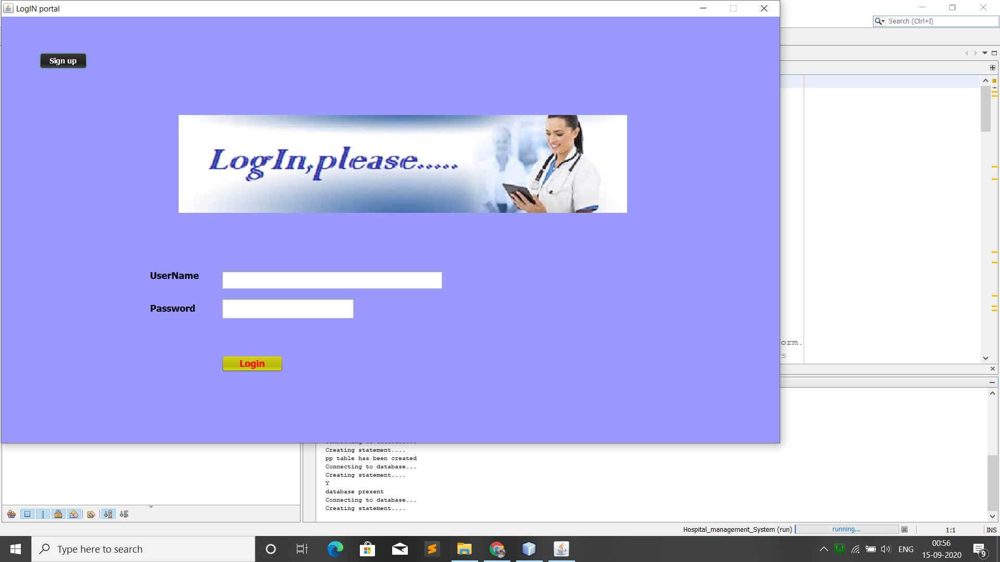
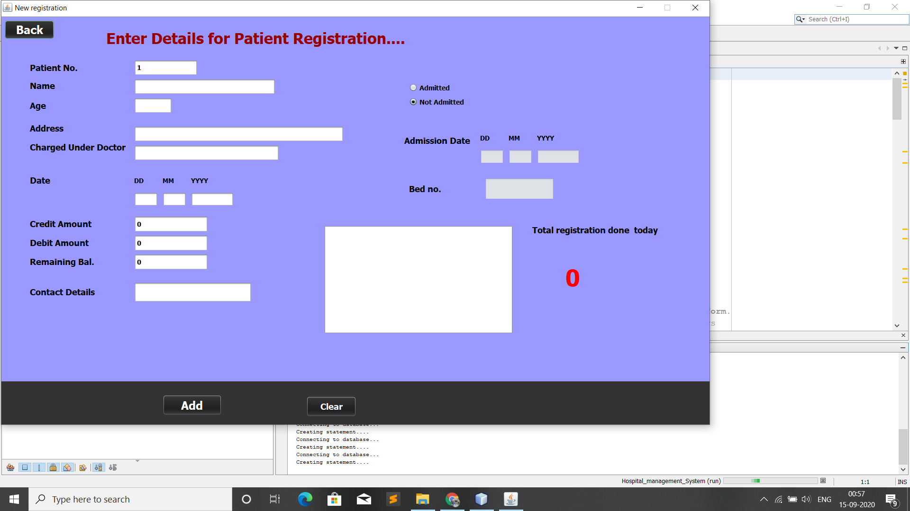

# Hospital-Management-System
It is developed using J2SE, JDBC and MySQL
How it works:
1)Clone it on your pc.
2)Start your MySql server.If you don't have any server pls download it.
3)Run .jar application on your system.

